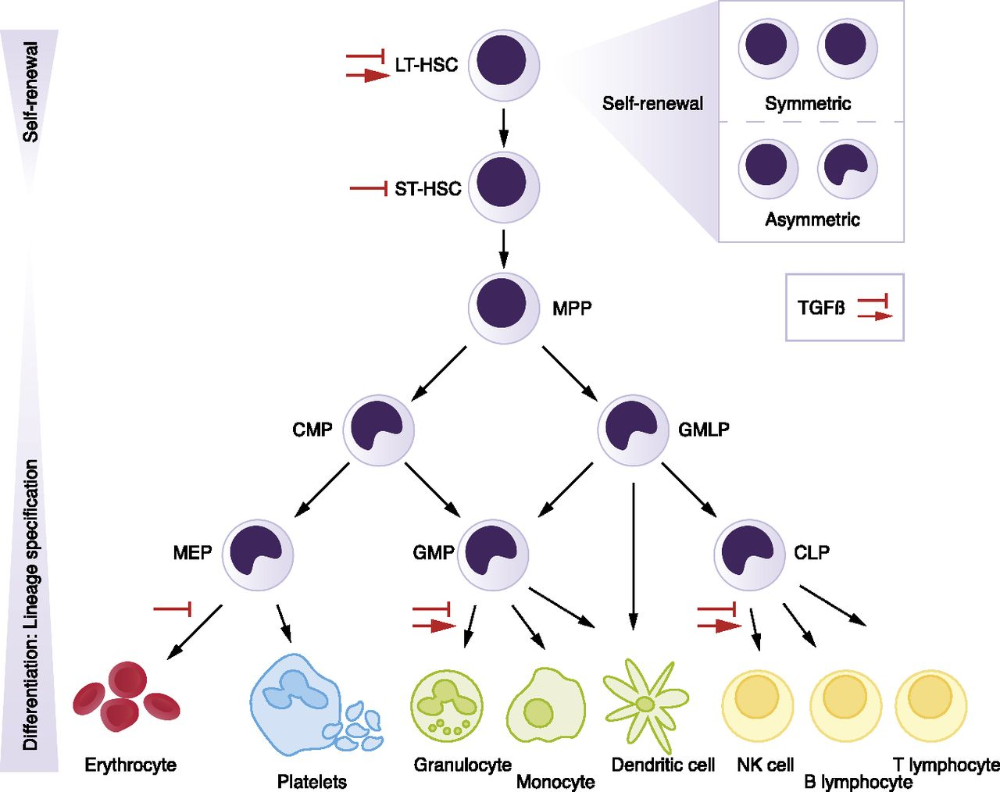

.. _docs-project:

Biological motivation
============================
Transcription factor (TF) activity constitutes an important readout of cellular signalling pathways and thus for assessing regulatory differences across conditions. However, current technologies lack the ability to simultaneously assessing activity changes for multiple TFs and surprisingly little is known about whether a TF acts as repressor or activator. To this end, we introduce the widely applicable genome-wide method diffTF to assess differential TF binding activity and classifying TFs as activator or repressor by integrating any type of genome-wide chromatin with RNA-Seq data and in-silico predicted TF binding sites.

For a graphical summary of the idea, see the section :ref:`workflow`

We also put the paper on *bioRxiv*, please see the section :ref:`citation` for details.

.. _exampleDataset:

Example dataset
=================

We provide a the toy dataset that is included in the Git repository to test diffTF. It is a small ATAC-Seq/RNA-Seq dataset comparing two cell types along the hematopoietic differentiation trajectory in mouse (multipotent progenitors - MPP - versus granulocyte-macrophage progenitors - GMP) and comes from `Rasmussen et al. 2018  <https://www.biorxiv.org/content/early/2018/05/31/336008>`_. Generally, hematopoiesis is organized in a hierarchical manner, and the following Figure shows the hematopoietic hierarchy in more detail and also places GMP and MPP cells:

      U.Blank et. al., Blood 2015 (http://www.bloodjournal.org/content/bloodjournal/125/23/3542/F1.large.jpg)

The data consists of ATAC-Seq data of 4 replicates for each of the two cell types (4 GMP vs. 4 MPP), and is limited to chr1 only to reduce running times and complexity. RNA-seq data are also available, which allows using the TF classification within the diffTF framework. As mentioned in the paper, the small number of samples makes the correlation-based classification of the TFs into activators and repressors unreliable, but we nevertheless include it here for the small dataset to show how to principally enable our AR classification in diffTF.

In the example analysis, you can investigate the differential TF activity of a set of 50 (or even all of the 400+) TFs to identify the known drivers of the well-studied mouse hematopoietic differentiation system. Overall, we expect to see TFs that more specific for stem cells renewal being more active in the MPPs, while in GMPs, TFs responsible for the further myeloid cell differentiation (CEBP family, NFIL3) should be enriched.

Help, contribute and contact
============================

If you have questions or comments, feel free to contact us. We will be happy to answer any questions related to this project as well as questions related to the software implementation. For method-related questions, contact Judith B. Zaugg (judith.zaugg@embl.de) or Ivan Berest (berest@embl.de). For technical questions, contact Christian Arnold (christian.arnold@embl.de).

If you have questions, doubts, ideas or problems, please use the `Bitbucket Issue Tracker <https://bitbucket.org/chrarnold/diffTF>`_. We will respond in a timely manner.

.. _citation:

Citation
============================

If you use this software, please cite the following reference:

Ivan Berest*, Christian Arnold*, Armando Reyes-Palomares, Giovanni Palla, Kasper Dindler Rassmussen, Kristian Helin & Judith B. Zaugg. *Quantification of differential transcription factor activity and multiomics-based classification into activators and repressors: diffTF*. 2018. in review.

We also put the paper on *bioRxiv*, please read all methodological details here:
`Quantification of differential transcription factor activity and multiomic-based classification into activators and repressors: diffTF <https://www.biorxiv.org/content/early/2018/12/01/368498>`_.

.. _changelog:

Change log
============================

Version 1.2.1 (2019-01-22)
    - Increased the value for ``expressions`` in R from 5000 (the R default) to 10000. Some users reported that they receive a "Error: evaluation nested too deeply: infinite recursion / options(expressions=)?" error message. Thanks to Benedict Man Hung Choi!

Version 1.2 (2018-12-10)
    - The Snakemake / *diffTF* pipeline can now be combined with **Singularity**. Singularity is similar to Docker and provides a containerization approach. This has significant implications for users: Except for Snakemake and Singularity, no other tool, R or R package has to be installed prior to using *diffTF* anymore, which makes installing *diffTF* much easier and completely independent of the underlying operating system. We now provide two Singularity containers with all necessary tools and packages that are automatically integrated into the workflow. See the section :ref:`docs-singularityNotes` and :ref:`docs-quickstart` for more details. **Please note that for this to work reliably, Snakemake must be updated to at least version 5.3.1**.
    - added two validity checks in the ``checkParameterValidity.R`` script for the TFBS files. Start and end coordinates are now asserted whether they are non-negative.

Version 1.1.8 (2018-11-07)
    - changed the call to the ``mlv`` function from the ``modeest`` package due to a breaking implementation change in version 2.3.2 that was published end of October 2018. *diffTF* now checks the package version for ``modeest`` and calls the functions in dependence of the specific version.

Version 1.1.7 (2018-10-25)
    - the default value of the minimum number of data points for a CG bin to be included has been raised from 5 to 20 to make the variance calculation more reliable
    - various small updates to the ``summaryFinal.R`` script

Version 1.1.6 (2018-10-11)
    - fixed small issue in ``checkParameterValidity.R`` when not having sufficient permissions for the folder in which the fasta file is located
    - updated the ``summaryFinal.R`` script. Now, for the Volcano plot PDF, in addition to adj. p-values, also the raw p-values are plotted in the end. This might be helpful for datasets with small signal when no adj. p-value is significant. In addition, labeling of TFs is now skipped when the number of TFs to label exceeds 150. THis makes the step faster and the PDF smaller and less crowded.
    - small updates to the translation table for mm10
    - adding two local rules to the Snakefile for potential minor speed improvements when running in cluster mode

Version 1.1.5 (2018-08-14)
    - optimized ``checkParameterValidity.R`` script, only TFBS files for TFs included in the analysis are now checked
    - addressed an R library compatibility issue independent of *diffTF* that users reported. In some cases, for particular versions of R and Bioconductor, R exited with a *segfault* (memory not mapped) error in the ``checkParameterValidity.R`` that seems to be caused by the combination of *DiffBind* and *DESeq2*. Specifically, when *DiffBind* is loaded *before* *DESeq2*, R crashes with a segmentation fault upon exiting, whereas loading *DiffBind* *after* *DESeq2* causes no issue. If there are further issues, please let us know. Thanks to Gyan Prakash Mishra, who first reported this.
    - fixed an issue when the number of peaks is very small so that some TFs have no overlapping TFBS at all in the peak regions. This caused the rule ``intersectTFBSAndBAM`` to exit with an error due to grep's policy of returning exit code 1 if no matches are returned (thanks to Jonas Ungerbeck, again).
    - removed the ``--timestamp`` option in the helper script ``startAnalysis.sh`` because this option has been removed for Snakemake >5.2.1
    - Documentation updates

Version 1.1.4 (2018-08-09)
    - minor, updated the ``checkParameterValidity.R`` script and the documentation (one package was not mentioned)

Version 1.1.3 (2018-08-06)
    - minor, fixed a small issue in the Volcano plot (legends wrong and background color in the plot was not colored properly)

Version 1.1.2 (2018-08-03)
    - fixed a bug that made the ``3.analyzeTF.R`` script fail in case when the number of permutations has been changed throughout the analysis or when the value is higher than the actual maximum number (thanks to Jonas Ungerbeck)

Version 1.1.1 (2018-08-01)
    - Documentation updates (referenced the bioRxiv paper, extended the section about errors)
    - updated the information on how to load the snakemake object into the R workspace in the corresponding R scripts
    - fixed a bug that made the labels in the Volcano plot switch sides (thanks to Jonas Ungerbeck)
    - merged some diagnostic plots for the AR classification in the last step
    - renamed R scripts and R log files to make them consistent with the cluster output and error files

Version 1.1 (2018-07-27)
    - added a new parameter ``dir_TFBS_sorted`` in the config file to specify that the TFBS input files are already sorted, which saves some computation time by not resorting them
    - updated the TFBS files that are available via download (some files were not presorted correctly)
    - added support for single-end BAM files. There is a new parameter ``pairedEnd`` in the config file that specifies whether reads are paired-end or not.
    - restructured some of the permutation-related output files to save space and computation time. The rule ``concatenateMotifsPerm`` should now be much faster, and the TF-specific ``...outputPerm.tsv.gz`` files are now much smaller due to an improved column structure

Version 1.0.1 (2018-07-25)
    - fixed a bug in ``2.DiffPeaks.R`` that sometimes caused the step to fail, thanks to Jonas Ungerbeck for letting us know
    - fixed a bug in ``3.analyzeTF`` for rare corner cases when *DESeq* fails

Version 1.0 (2018-07-01)
    - released stable version

License
============================

diffTF is licensed under the MIT License:

.. literalinclude:: ../LICENSE.md
    :language: text
